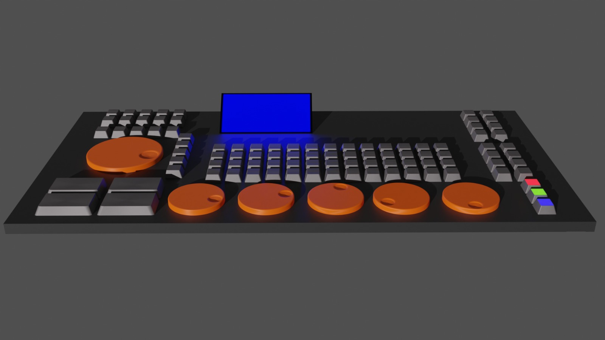

# Macro Keyboard
This Repository is for the Software of the Macro Keyboard developed by [Meiiikum](https://github.com/Meiiikum) and [ScheerleJo](https://github.com/ScheerleJo). The Hardware Components and 3d-Models is on Thingiverse (Link Coming soon). It will look something like this: 

The Plan is to 3d-Print everything possible including the Enclosure, Keycaps, Encoder-Wheels and so on.

## Aim
The Aim of this project is to
- get better at 3d Modelling and sharpen coding skills
- but more important to simplify and speed up various tasks. From Editing Videos to writing Code or possibly even Gaming shall be all included

## Plans
The Keyboard will have multiple Layers for the different applications of usage for it. 
A few functions will be the same over the different Layers such as:
-   Open pograms like the Adobe Creative Cloud / Gimp / 
-   Implement 3 or 4 different clipboards to store different contents and paste them directly when previously imported in one of the clipboard banks.

### Editing Layer
This Layer will have the ability to access the Premiere CEP interface to speed up and Control important funtions.
-   [ ] stabilizion has to be implemented
-   [ ] disable all applied effects
-   [ ] 16:9 sizer
-   [ ] save project as (Sicherheitskopie)
-   [ ] zoom out to see the whole project in the timeline
-   [ ] Zoom in/out on selected clip
-   [ ] Crop in/out by 20% is not possible josiaSAD
-   [ ] Spotify control
-   [ ] gauisian blur
-   [ ] Drop shadow
-   [ ] Lumetri color window opens
-   [ ] lumetri Color Encoder
-   [ ] Switch audio channels to left only
-   [ ] Switch audio channels to right only
-   [ ] lowers the volume by 3db of selected clip (relative)
-   [ ] raises the volume by 3db of selected clip (relative)
-   [ ] mute selected clip
-   [ ] run screenshottool
-   [ ] opening Programs next to the numpad
-   [ ] jump to marker (1-10) & next/previous Marker
-   [ ] color selected CLips in color a/b/c/d
-   [ ] disable all applied effecs on all selected clips
            
### Utility Layer
That will be the standard Layer, what the Keyboard will boot to by default. When not using for editing or programming, some useful macros and tools shall be available for direct access.

### Programming Layer
The Programming Layer will implement some simple functions for the better development of software on windows. 
Some useful functions would be

-   [ ] Open CMD in the current directory
-   [ ] Open VSC with the working directory on the current active folder
-   [ ] pulling the new code from Github
-   [ ] ...

## Current status
Currently there is little progress done. The main task is to model and create the hardware of the Keyboard before it can be fully tested.
Next up is to find a software architecture which handles all the communication between the controller of the Keystrokes connected to the micro-controller and the different functions and programming languages in the layers

## Developers
 | [`@ScheerleJo`](https://github.com/ScheerleJo)
 | [`@Meiiikum`](https://github.com/Meiiikum)
